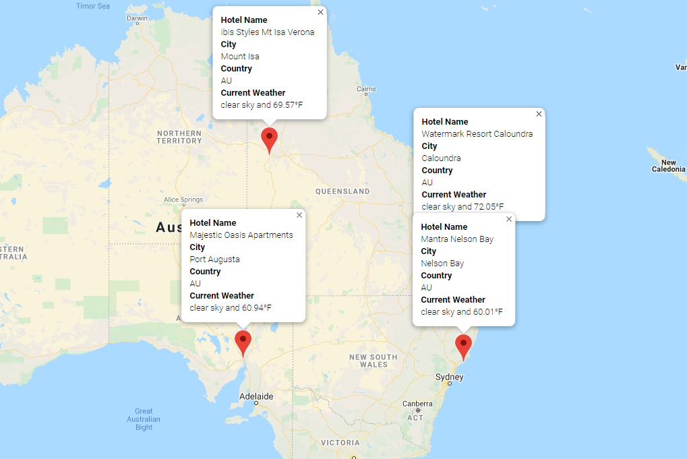
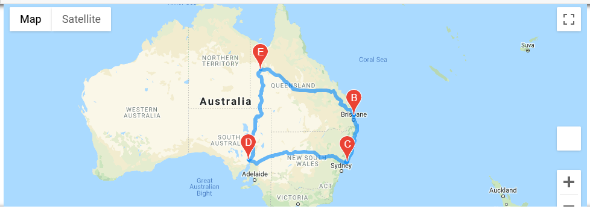

# World Weather Analysis
### Vacation Planning Tool

This analysis takes input from the user and makes API calls to OpenWeatherMap and Google Maps to collect weather data and filter results based on user preferences. Then, a sample itinerary was created with four cities in Australia. Pop ups contain hotel and weather information.

A route map was also provided.

